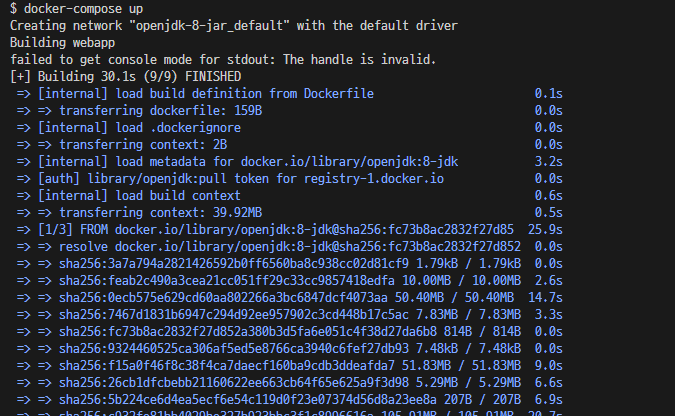

# jar로 bundle한 Web Application 띄워보기 
---

## 배경

Spring Framework를 통해(정확히는 Spring Web MVC) 작성한 프로그램은
Tomcat을 통해 실행할 수 있었습니다.

하지만, Spring Boot에는 내장 톰캣(Embedded Tomcat)이 존재합니다.
따라서 별도의 Tomcat을 준비하지 않더라도 
프로그램 내에 존재하는 main 메서드를 실행하면, 톰캣이 가동하면서 서버가 실행됩니다.
(물론, war로 패키징하여 기존과 같이 외부 Tomcat을 통해 실행할 수도 있습니다.)

이 경우, 컨테이너 JDK( + JRE )만 존재해도 아무런 문제가 없죠.

---

## 컨테이너 구성해보기
---

## 준비된 Web Application 설명

실습에 필요한 jar파일은 미리 준비해뒀습니다.

Application이 실행되는 기본 포트는 8080포트이며
`http://localhost:8080` 으로 GET 요청을 할 경우 `{user : "guest"}` 와 같은 응답을 내려줍니다.
또, 쿼리스트링으로 name 이라는 KEY에 원하는 값(VALUE) 담아 GET 요청을 하면
(ex : `curl http://localhost:8080/?name=VALUE`)
{user : VALUE} 형태로 응답을 내려주는 정말 간단한 어플리케이션입니다.


### Dockerfile 작성

```dockerfile
FROM openjdk:8-jdk
# 시작 이미지는 openjdk:8-jdk로 한다.

COPY ./jar/* /usr/local/app/app.jar
# local <./jar/*> 경로에 존재하는 파일을 docker container 내 </user/local/app/> 경로에 app.jar로 복사한다.

WORKDIR /usr/local/app
# 본 Dockerfile로 build한 이미지가 실행될 때, 작업이 실행되는 경로를 /usr/local/app으로 한다

CMD ["java", "-jar", "app.jar"]
# 위의 명세한 작업이 모두 완료된 후, java -jar app.jar 커맨드를 실행한다.
```

Dockerfile은 위와 같이 작성합니다.
주석문 내에 필요한 설명은 모두 작성했으므로 넘어가겠습니다.

---
### docker-compose.yml 작성

```yaml
# docker-compose의 버전명시
version: "3"

# service들의 목록 나열
services: 
  # jar파일을 실행하는 것이 전부이기 때문에, 하나의 서비스만 필요하다
  webapp:
    container_name: webapp
    build:
      context: .
      dockerfile: ./Dockerfile
    ports:
      - "8080:8080"
```

**webapp 서비스**

webapp 서비스는 누군가 작성해놓은 이미지를 시작으로 
**우리가 필요로 하는 것을 추가 명세한 Dockerfile를 통해 새로운 Image를 build한 후 사용**합니다.

이는 JDK만 존재하는 이미지에 JAR를 옮겨넣은 후 사용하기 위함입니다.

- build:
    이미지를 직접 사용하지 않고 빌드할 것임을 기술해줍니다.
    - context:
      dockerfile이 실행할 때의 배경(context)가 어디인지 명시해줍니다.
    - dockerfile:
      dockerfile의 전체 경로를 작성합니다.

---

# docker-compose 를 통해 구성한 환경을 컨테이너에 띄우기

```bash
# docker-compose.yml을 읽어 각 서비스 컨테이너를 실행하는 명령어
docker-compose up

# docker-compose.yml에 작성된 각 서비스 컨테이너를 종료(stop)하고, 제거(remove)하는 명령어

docker-compose down
```

모든 코드작성이 완료 되었다면, 이제 `docker-compose up`을 실행합시다.



위와 같이 잘 실행되고 있는것을 확인할 수 있습니다.

# 실행된 어플리케이션에 요청해보기

```bash

$ curl http://localhost:8080
> {"user" : "guest"}

$ curl http://localhost:8080?name=todak
> {"user" L "todak"}

```

